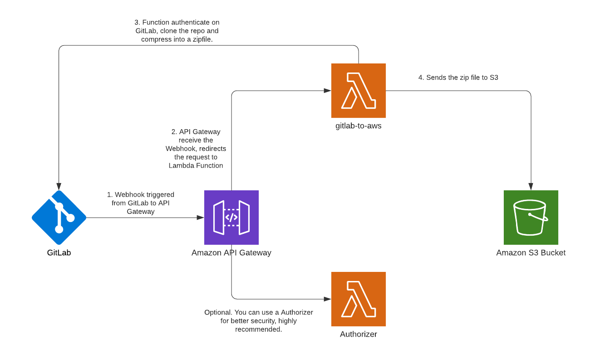

# AWS GitLab Connector to AWS S3

Currently, AWS CodeDeploy / AWS CodeBuild and AWS CodePipeline do not support GitLab repositories. They are currently supporting GitHub, GitHub Enterprise, Bitbucket, AWS CodeCommit, Amazon S3 and Amazon ECR. This tool aims to allow you to be able to use these tools, deploying your repository on GitLab to Amazon S3 whenever it is updated. To use it you just need to follow the steps below.

## Requirements
* AWS CLI with S3 and Lambda creation permissions

## Architecture

## How to use

### In progress
